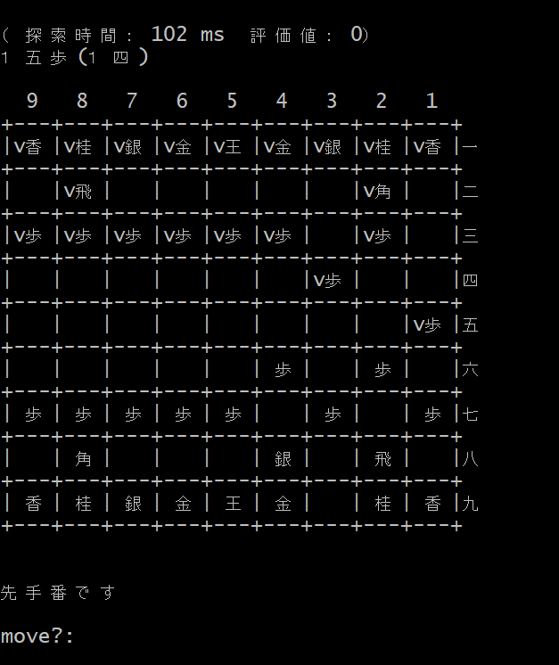

#### 機能

TypeScript による本将棋の AI ライブラリを目指しています。  
現時点では node.js から起動し、コンソール上のみで動作します。  
node.js には readline-sync モジュールのインストールが必要です。

現時点での棋力は「いちおうルール通りに指せる将棋おぼえたて」くらいです。

---

#### 使い方

- TSshogi.js がトランスパイル済の js ファイルです。  
  TSshogi.js をダウンロードの上、コンソールから node.js で実行してください。  
  node.js には readline-sync モジュールのインストールが必要です。

- コンソールに盤面が表示されますので、下記入力ルールに従って指し手を入力してください。

- 入力ルール

  1. 盤上の駒を動かす場合、移動元の位置を二桁の数字、  
     続けて移動先の位置を二桁の数字、合わせて四桁の数字で入力する。  
     初手２六歩の場合は「2726」となる。
  2. 成る時は末尾に「_」を付ける。  
     ２三歩成の場合は「2423_」となる。
  3. 持駒を打つ際は移動元の代わりに先頭二桁で駒種を表す。  
     ３三角打の場合は「0633」となる。
  4. 投了の際は「%TORYO」と入力する。
  5. デバッグ用：「p」で合法手一覧を生成

- 駒種  
  歩：01  
  香：02  
  桂：03  
  銀：04  
  金：05

---

#### 今後の予定

- KIF 形式の入出力に対応した API を実装し、ライブラリとして活用できるようにする。
- PIXI.JS による、思考部とは独立した UI を用意し、ゲームとして公開。（RPG ツクール MZ に乗せる予定）
- 棋力強化。
  - 定跡に対応。（定跡ファイルの作成および定跡にしたがって指し手を選択する機能）
  - 思考ルーチンに駒の損得以外の視点を増やす。（相互の玉周りの堅さ、攻め駒と相手玉の位置関係）
  - 高速化（手法は追々）

---

#### 連絡先

Twitter: https://twitter.com/geregeregere  
GitHub: https://github.com/gere-gere
